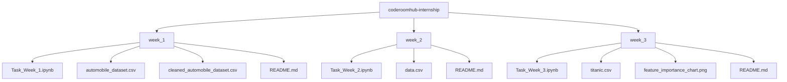

# 🎓 Code Room Hub – AI/ML Track Internship

## 📌 About
This repository contains all weekly tasks completed as part of the **AI/ML Track Internship at Code Room Hub** — a 6-week Machine Learning Internship including a mandatory 15-Day ML Training phase, completed remotely.

| | |
|---|---|
| **Internship ID** | CRH-2026-ML-014 |
| **Track** | AI/ML |
| **Duration** | 1 July 2026 – 30 Aug 2026 |
| **Mode** | Remote |

## 🗂️ Repository Structure

## 📅 Weekly Progress
| Week | Task | Status | Link |
|---|---|---|---|
| 1 | Exploratory Data Analysis on Automobile Dataset | ✅ Completed | [week_1](./week_1) |
| 2 | Supervised ML on Breast Cancer Dataset (5 models + tuning) | ✅ Completed | [week_2](./week_2) |
| 3 | Feature Engineering & Ensemble Learning (Titanic Dataset) | ✅ Completed | [week_3](./week_3) |

## 🛠️ Tech Stack
`Python` `Pandas` `NumPy` `Scikit-learn` `XGBoost` `LightGBM` `Matplotlib` `Seaborn`

<strong>📖 About Code Room Hub Internship Program</strong>

The AI/ML Track at Code Room Hub focuses on building practical, hands-on machine learning skills — starting from data analysis fundamentals and progressing to model training, evaluation, and tuning across real-world datasets.

## 👤 Author
**Arham Rizwan**
BS Robotics and Artificial Intelligence, University of Lahore
