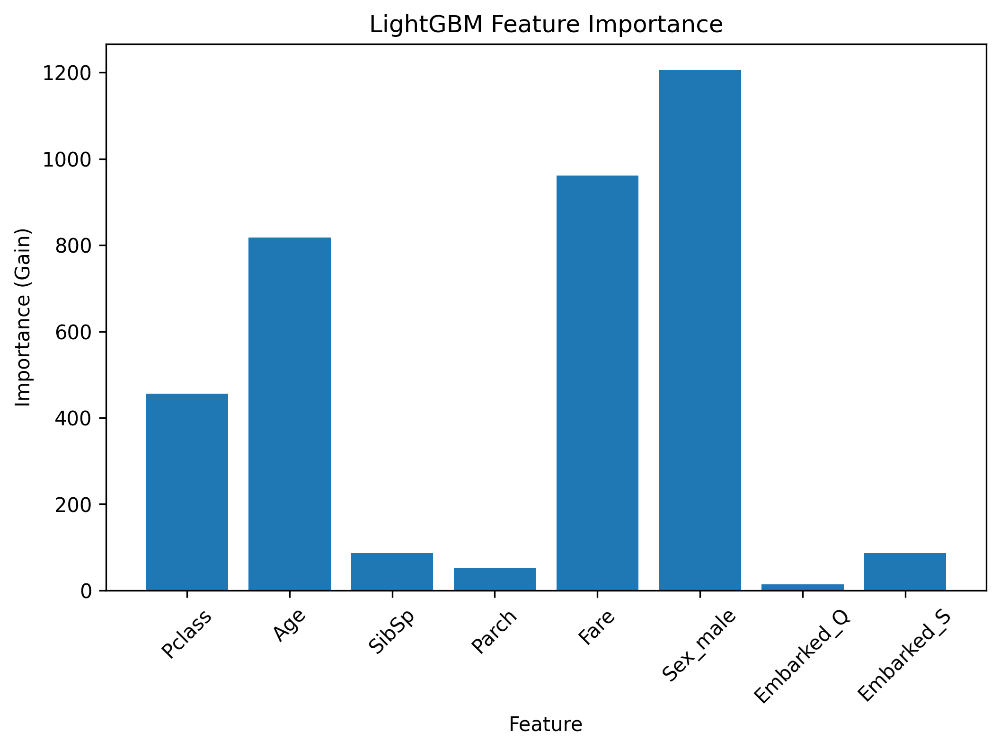
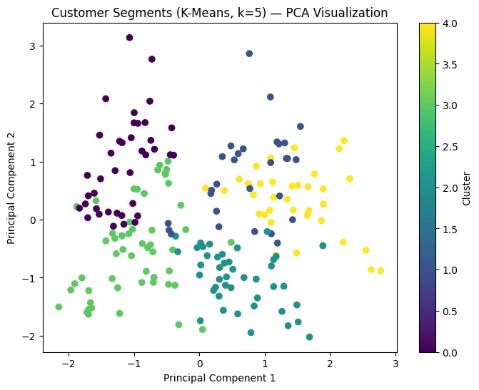

<div align="center">

# 🎓 Code Room Hub — AI/ML Track Internship

### From exploratory data analysis to real-world predictive modeling

**Code Room Hub** · Internship ID `CRH-2026-ML-014` · Jul 2026 → Aug 2026


</div>

---

## 📑 Table of Contents
- [📊 Internship Progress](#-internship-progress)
- [🎯 Week-by-Week Breakdown](#-week-by-week-breakdown)
- [🗂️ Repository Structure](#️-repository-structure)
- [📈 Performance Highlights](#-performance-highlights)
- [🛠️ Tech Stack](#️-tech-stack)
- [💡 Skills Gained](#-skills-gained)
- [👤 Author](#-author)

---

## 📊 Internship Progress

<div align="center">

```
Overall Progress:  ████████████████████████░░░░░  83%  (5 / 6 Weeks)
```

</div>

| Week | Topic | Status |
|:---:|---|:---:|
| **1** | Exploratory Data Analysis — Automobile Dataset | ✅ Completed |
| **2** | Supervised ML — Breast Cancer Classification | ✅ Completed |
| **3** | Feature Engineering & Ensemble Learning — Titanic | ✅ Completed |
| **4** | Unsupervised Learning — Customer Segmentation & Anomaly Detection | ✅ Completed |
| **5** | Real-World ML Project — Retail Sales Forecasting | ✅ Completed |
| **6** | Capstone Project | ⚪ Pending |

---

## 🎯 Week-by-Week Breakdown

<details>
<summary><strong>📌 Week 1 — Exploratory Data Analysis</strong></summary>

*Understanding a real-world dataset through cleaning and visualization*

```
Raw Dataset → Load & Inspect → Handle Nulls → Visualize → Extract Insights
(Automobile)    (df.info())    (median/mode)   (Seaborn)   (price drivers)
```

| What I Learned |
|---|
| Loading & inspecting real-world tabular data |
| Handling missing values with domain-appropriate strategies |
| Univariate & bivariate visualization |
| Identifying outliers and skewed distributions |

**Notebook:** [`week_1/Task_Week_1.ipynb`](./week_1/Task_Week_1.ipynb)

</details>

<details>
<summary><strong>📌 Week 2 — Supervised Machine Learning</strong></summary>

*Classifying malignant vs. benign tumors on the Breast Cancer dataset*

```
Breast Cancer Data → Train/Test Split → 5 Models Trained → Cross-Validation → GridSearchCV
                                              ↓
                          Logistic Regression · Decision Tree · KNN · SVM · Naive Bayes
                                              ↓
                              Hyperparameter tuning applied to Decision Tree
```

| What I Learned |
|---|
| Training & comparing multiple classification algorithms |
| K-Fold cross-validation for robust evaluation |
| Hyperparameter tuning with `GridSearchCV` |
| Reading confusion matrices & classification reports |

**Notebook:** [`week_2/Task_Week_2.ipynb`](./week_2/Task_Week_2.ipynb)

</details>

<details>
<summary><strong>📌 Week 3 — Feature Engineering & Ensemble Learning</strong></summary>

*Predicting Titanic survival with leak-safe pipelines and 4 ensemble models*

```
Titanic Dataset → Clean & Encode → sklearn Pipeline → 4 Ensemble Models → Feature Importance
   (891 rows)      (Sex, Embarked)   (Scaler + Model)         ↓
                                                    LightGBM: 82.68% ✅ (best)
                                                    Random Forest: 82.12%
                                                    Gradient Boosting: 80.45%
                                                    XGBoost: 80.45%
```



| What I Learned |
|---|
| Building leak-safe pipelines with `StandardScaler` + model |
| Comparing 4 ensemble algorithms on identical splits |
| Split-based vs. gain-based feature importance |
| `Sex`, `Fare`, `Age` emerged as the strongest survival predictors |

**Key Insight:** Gain-based importance gave a truer ranking than split-count — split-count favored continuous features (`Age`/`Fare`) purely for having more possible split points.

**Notebook:** [`week_3/Task_Week_3.ipynb`](./week_3/Task_Week_3.ipynb)

</details>

<details>
<summary><strong>📌 Week 4 — Unsupervised Learning</strong></summary>

*Segmenting mall customers and flagging anomalies without labels*

```
Mall Customers → Scale Features → PCA (2D) → K-Means + Hierarchical → DBSCAN
  (200 rows)      (StandardScaler)  (59.9% var)     (5 clusters each)   (13 anomalies)
```



| Cluster | Segment | Avg Age | Avg Income | Avg Spend |
|---|---|---|---|---|
| 0 | Premium Young Spenders | 32.7 | $86.5k | 82.1 |
| 1 | High Income, Low Engagement | 36.5 | $89.5k | 18.0 |
| 2 | Average Female Customers | 49.8 | $49.2k | 40.1 |
| 3 | Young Budget-Conscious | 24.9 | $39.7k | 61.2 |
| 4 | Older Male, Moderate Spenders | 55.7 | $53.7k | 36.8 |

| What I Learned |
|---|
| Dimensionality reduction with PCA for visualization |
| K-Means (elbow method) vs. Hierarchical Clustering (dendrogram) — cross-validated, strong agreement |
| DBSCAN for density-based anomaly detection — **13/200 customers (6.5%) flagged** |
| Interpreting and profiling clusters into actionable business segments |

**Notebook:** [`week_4/Task_Week_4.ipynb`](./week_4/Task_Week_4.ipynb)

</details>

<details>
<summary><strong>📌 Week 5 — Real-World ML Project: Retail Sales Forecasting</strong></summary>

*Forecasting daily Rossmann store sales end-to-end on 1M+ records*

```
Rossmann Data → Clean & Merge → Feature Engineer → Time-Based Split → 3 Models Compared
 (1,017,209 rows) (train+store)  (date, competition,      ↓
                                    promo features)   Random Forest: R² 0.873 ✅ (best)
                                                        LightGBM:      R² 0.673
                                                        Linear Reg.:   R² 0.261
```


| Model | MAE | RMSE | R² |
|---|---:|---:|---:|
| Linear Regression | 1977.58 | 2674.01 | 0.261 |
| **Random Forest** | **766.78** | **1107.82** | **0.873** |
| LightGBM | 1328.59 | 1779.38 | 0.673 |

| What I Learned |
|---|
| Building a full pipeline: load → clean → merge → engineer → encode → time-split |
| Row-wise feature engineering (`CompetitionOpen`, `Promo2Active`) using `.apply()` |
| **Time-based splitting** instead of random shuffling to prevent lookahead leakage |
| Dropping `Customers` as a leakage feature (not known at prediction time) |
| Honest reporting: LightGBM underperformed Random Forest here — flagged as a tuning gap, not hidden |

**Key Insight:** `CompetitionDistance` and `Store` dominated feature importance — a sign the model partly memorizes per-store baselines rather than purely learning generalizable demand patterns.

**Notebook:** [`week_5/Task_Week_5.ipynb`](./week_5/Task_Week_5.ipynb)

</details>

---

## 🗂️ Repository Structure

```
coderoomhub-internship/
├── week_1/          → EDA: Automobile Dataset
├── week_2/          → Supervised ML: Breast Cancer Classification
├── week_3/          → Feature Engineering & Ensemble Learning: Titanic
│   └── feature_importance_chart.png
├── week_4/          → Unsupervised Learning: Customer Segmentation
│   └── images/      → elbow, PCA clusters, dendrogram, k-distance, DBSCAN
├── week_5/          → Real-World Project: Retail Sales Forecasting
│   └── images/      → sales distribution, day-of-week, trend, feature importance
└── README.md
```

---

## 📈 Performance Highlights

| Task | Metric | Result |
|---|---|---|
| Week 3 — Titanic Survival (best model) | Accuracy | **82.68%** (LightGBM) |
| Week 4 — Customer Anomaly Detection | Anomalies Flagged | **13 / 200 (6.5%)** |
| Week 4 — PCA Variance Retained | Explained Variance | **59.9%** |
| Week 5 — Retail Sales Forecast (best model) | R² Score | **0.873** (Random Forest) |
| Week 5 — Dataset Scale | Rows Processed | **1,017,209** |

---

## 🛠️ Tech Stack

<details>
<summary><strong>Languages & Core Libraries</strong></summary>
<br>


</details>

<details>
<summary><strong>Machine Learning</strong></summary>
<br>


</details>

<details>
<summary><strong>Visualization</strong></summary>
<br>


</details>

---

## 💡 Skills Gained

```
Data Wrangling        ████████████████████ Cleaning, merging, null-handling across 5 datasets
Feature Engineering   ████████████████████ Date features, domain features, encoding, scaling
Supervised Learning   ████████████████████ 9+ algorithms: linear, tree-based, boosting
Unsupervised Learning ████████████████████ PCA, K-Means, Hierarchical, DBSCAN
Model Evaluation       ███████████████████ Cross-validation, GridSearchCV, MAE/RMSE/R², accuracy
Interpretability      ████████████████████ Feature importance (split vs. gain-based)
Git / GitHub           ███████████████████ Structured, documented weekly submissions
```

---

## 👤 Author

**Arham Rizwan**
AI/ML Track Intern — Code Room Hub (`CRH-2026-ML-014`)

[](https://github.com/arhamrizwan2006)
