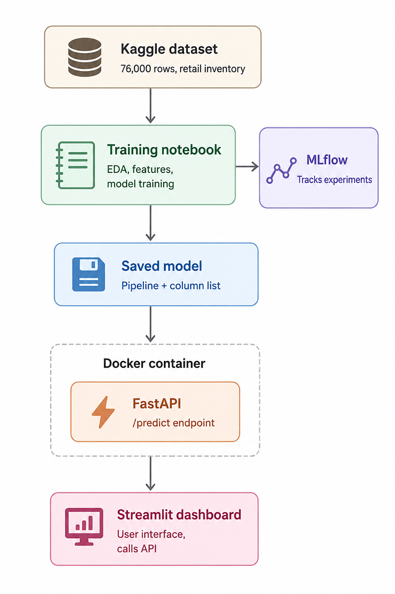
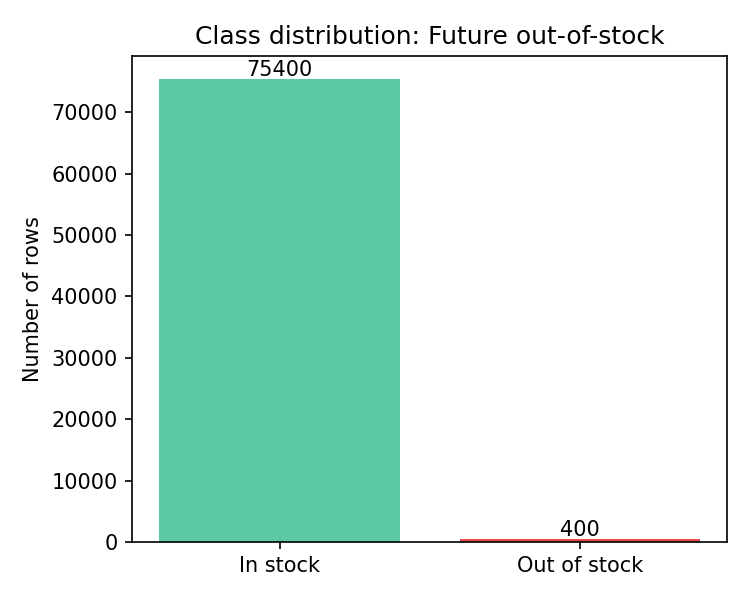
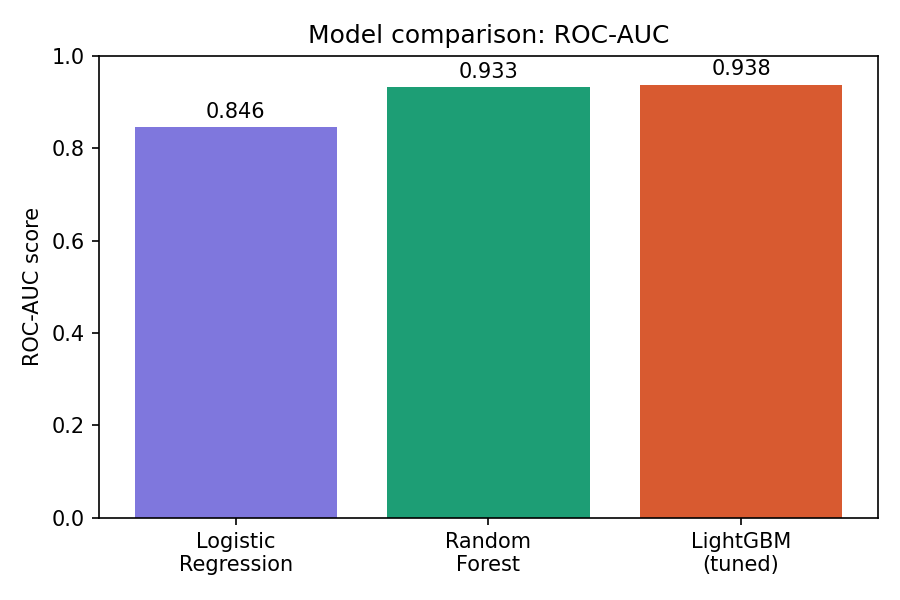
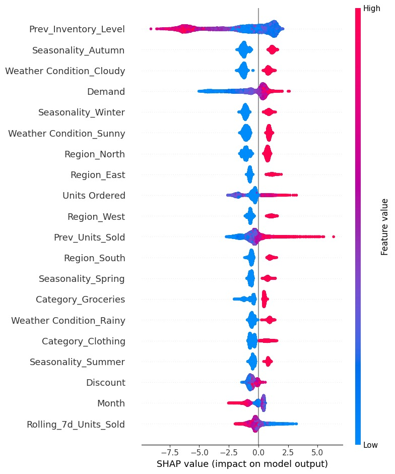
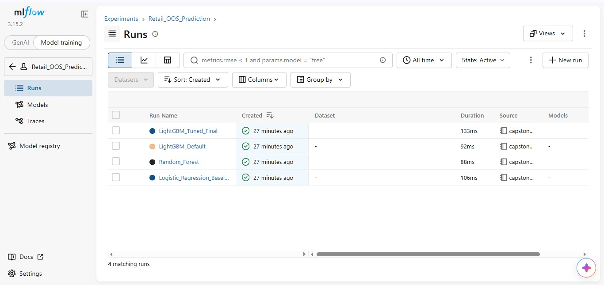
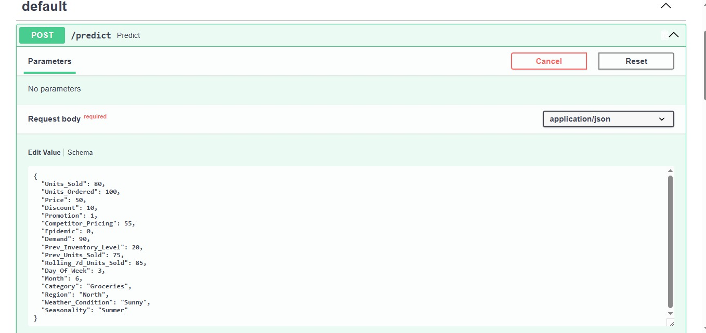
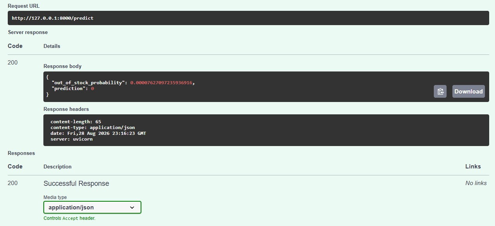
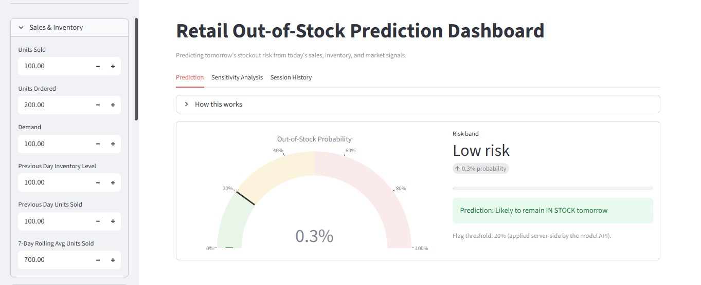
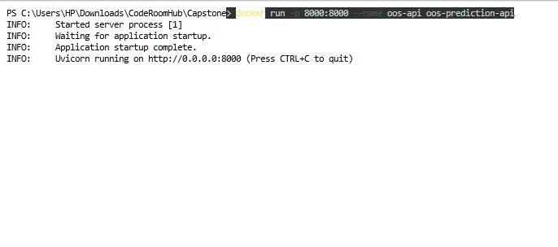

# Retail Out-of-Stock Prediction System

**Final Capstone Project — Code Room Hub AI/ML Internship**
Topic: Retail Shelf Intelligence System (Out-of-Stock Detection & Inventory Insights)


---

## Table of Contents

- [Overview](#overview)
- [System Architecture](#system-architecture)
- [Problem Framing](#problem-framing)
- [Pipeline](#pipeline)
- [Results](#results)
- [Explainability (SHAP)](#explainability-shap)
- [Experiment Tracking (MLflow)](#experiment-tracking-mlflow)
- [Deployment](#deployment)
- [Known Limitations](#known-limitations)
- [Key Learnings](#key-learnings)
- [Project Structure](#project-structure)
- [Running It](#running-it)
- [Tech Stack](#tech-stack)

---

## Overview

This project predicts whether a store-product combination will run out of stock **the next day**, using historical inventory, sales, and pricing data. It's built as a full end-to-end ML system: data pipeline, model comparison, explainability, experiment tracking, and deployment via a REST API and interactive dashboard.

**Dataset:** [Retail Store Inventory and Demand Forecasting](https://www.kaggle.com/datasets/atomicd/retail-store-inventory-and-demand-forecasting) (Kaggle) — 76,000 rows covering 5 stores × 20 products over 760 days.

## System Architecture



The system flows from raw sales/inventory data through feature engineering and model training, into a tracked experiment registry, and out to two live interfaces (API + dashboard), both served from the same trained pipeline and containerized for deployment.

## Problem Framing

Out-of-stock (OOS) events are rare — only **0.53%** of rows in this dataset have zero inventory.



The project frames this as a **forward-looking binary classification problem**: given today's sales, orders, pricing, and recent trends, predict whether the product will be out of stock **tomorrow**.

### A note on data leakage (and why it matters)

An early version of this model scored a suspicious ROC-AUC of 1.0. Investigation revealed the target (`Inventory Level == 0`) was mathematically reconstructable from same-day features already in the dataset (`Inventory Level ≈ Previous Inventory + Units Ordered − Units Sold`). This is a common and easy-to-miss trap in inventory/time-series problems: using same-day figures to predict a same-day outcome isn't really *prediction*, it's just re-deriving the answer.

**Fix:** the target was redefined as `Future_OOS` — tomorrow's stock status — using only information that would legitimately be known today. This dropped the ROC-AUC to an honest ~0.94, which is the real, defensible number reported below.

## Pipeline

1. **EDA** — date range, cardinality checks, class balance, logical consistency checks, category/promotion breakdowns
2. **Feature engineering** — lag features (previous day inventory/sales), 7-day rolling sales average, day-of-week/month, one-hot encoded categoricals
3. **Preprocessing** — stratified 80/20 train/test split, SMOTE oversampling (training set only, applied inside cross-validation folds to avoid leakage)
4. **Model comparison** — Logistic Regression, Random Forest, LightGBM
5. **Hyperparameter tuning** — GridSearchCV with 5-fold cross-validation (via an `imblearn` pipeline so SMOTE is applied correctly within each fold)
6. **Explainability** — SHAP TreeExplainer on the final LightGBM model
7. **Experiment tracking** — MLflow, logging all 4 model runs with parameters and metrics
8. **Deployment** — FastAPI REST API + Streamlit dashboard, containerized with Docker

## Results

| Model | ROC-AUC | Precision (class 1) | Recall (class 1) | F1 (class 1) |
|---|---|---|---|---|
| Logistic Regression | 0.846 | 0.14 | 0.10 | 0.12 |
| Random Forest | 0.933 | 0.10 | 0.15 | 0.12 |
| LightGBM (default) | 0.944 | 0.17 | 0.26 | 0.20 |
| **LightGBM (tuned)** | **0.938** | 0.16 | 0.15 | 0.15 |



*Metrics for classes shown at a 0.2 decision threshold (not the default 0.5) — see "Threshold tuning" below.*

Best hyperparameters (via 5-fold cross-validated GridSearchCV): `learning_rate=0.1, max_depth=7, n_estimators=200, num_leaves=31`

### Threshold tuning

At the default 0.5 probability threshold, models — especially Random Forest — rarely predict the minority class at all, since true stockouts are so rare. Lowering the threshold to 0.2 recovers meaningful recall without collapsing precision. This is a deliberate modeling choice, not a bug: in a real inventory system, missing a stockout (false negative) is usually costlier than a false alarm (false positive), so a lower threshold is the more business-appropriate choice.

## Explainability (SHAP)



The most influential features, in order:

1. **Previous day's inventory level** — by far the strongest signal; low prior-day stock sharply increases predicted risk
2. **Demand** — higher demand increases risk
3. **Units ordered** — counterintuitively associated with *higher* predicted risk, likely reflecting reactive restocking (stores order more when they anticipate running low)
4. **Recent sales trend** (previous day's sales, 7-day rolling average) — sustained high sales increase risk

Categorical features (region, season, weather, category) have real but comparatively minor influence.

## Experiment Tracking (MLflow)

All 4 models were trained and logged as separate MLflow runs, with parameters and metrics tracked for comparison and reproducibility.



## Deployment

The trained pipeline is served two ways from the same model artifact:

**FastAPI REST API** — a `/predict` endpoint accepting store/product features and returning an out-of-stock probability and binary prediction.

| Request | Response |
|---|---|
|  |  |

**Streamlit Dashboard** — an interactive interface for exploring predictions with a live risk gauge, risk band, and plain-language recommendation.



**Docker** — the API is containerized for portable, reproducible deployment.



## Known Limitations

Testing the deployed model with extreme low-inventory inputs (e.g. previous inventory of 2 vs. 15) produced nearly identical, very low probabilities. This suggests LightGBM's learned tree splits don't finely distinguish within the very-low-inventory range — likely due to limited training examples in that exact zone. This is consistent with the model's modest recall and is an honest limitation of the current approach, not a deployment bug.

## Key Learnings

- **Leakage is easy to miss in inventory/time-series data.** A "perfect" 1.0 ROC-AUC was a red flag, not a win — same-day features that are algebraically tied to the target will always look too good. Reframing the target around a strictly future outcome fixed this.
- **Accuracy is the wrong metric for a 0.53%-positive problem.** ROC-AUC and threshold-adjusted precision/recall told a much more honest story than a raw accuracy score ever could.
- **The right decision threshold depends on the business cost, not the default.** Moving from 0.5 to 0.2 was a deliberate trade-off favoring recall, because a missed stockout is costlier than a false alarm in this context.
- **A trained model isn't the finish line.** Getting the same pipeline to work consistently across a notebook, a REST API, a dashboard, and a Docker container surfaced real integration issues (feature ordering, environment consistency) that don't show up during training.

## Project Structure

```
capstone/
├── images/                                 # Diagrams and screenshots used in this README
├── capstone.ipynb                          # Full analysis notebook (EDA → modeling → SHAP)
├── app.py                                  # FastAPI REST API (/predict endpoint)
├── dashboard.py                            # Streamlit interactive dashboard
├── Dockerfile                              # Container definition
├── requirements.txt                        # Python dependencies
├── oos_prediction_model.pkl                # Trained LightGBM pipeline (SMOTE + model)
├── model_columns.pkl                       # Feature column order, for API input alignment
├── sales_data.csv                          # Source dataset
└── README.md
```

## Running It

### 1. API (FastAPI)

```bash
pip install -r requirements.txt
uvicorn app:app --reload
```
Visit `http://127.0.0.1:8000/docs` for the interactive API docs.

### 2. Dashboard (Streamlit)

With the API running in a separate terminal:
```bash
streamlit run dashboard.py
```

### 3. Docker (containerized API)

```bash
docker build -t oos-prediction-api .
docker run -p 8000:8000 oos-prediction-api
```

## Tech Stack

Python, pandas, scikit-learn, imbalanced-learn (SMOTE), LightGBM, SHAP, MLflow, FastAPI, Streamlit, Docker
