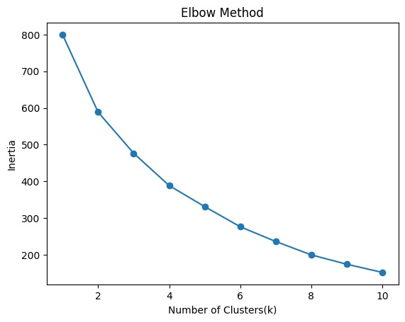
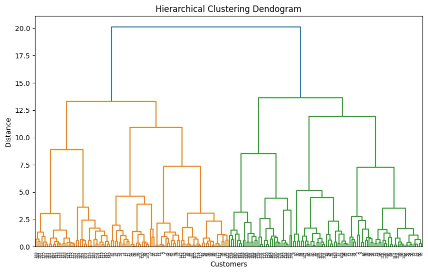
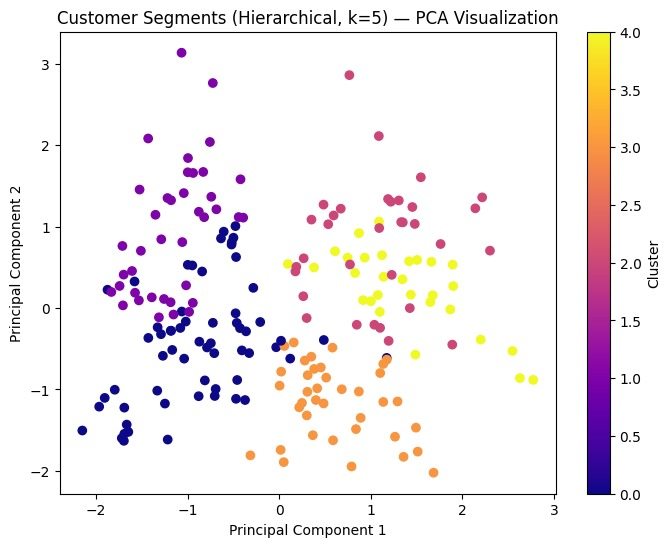
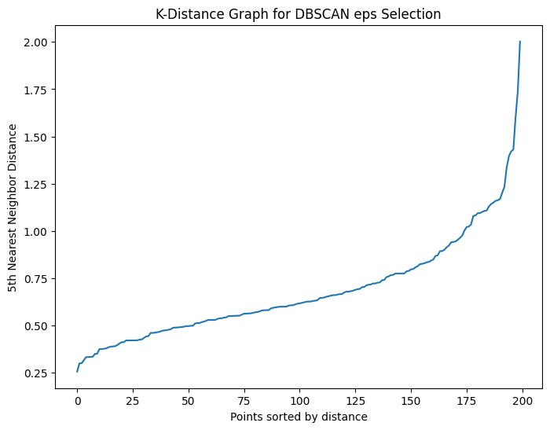
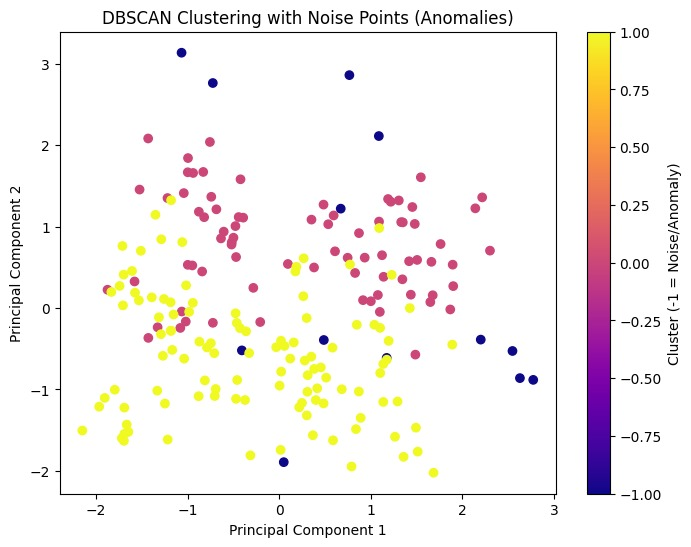

# Week 4: Unsupervised Learning — Customer Segmentation & Anomaly Detection

## Objective
Discover hidden patterns in unlabeled customer data using clustering, dimensionality reduction, and anomaly detection.

## Dataset
Mall Customer Segmentation Data (`Mall_Customers.csv`) — 200 customers, 5 columns: CustomerID, Gender, Age, Annual Income (k$), Spending Score (1-100). No missing values or duplicates found.

## Workflow

### 1. Preprocessing
- Encoded `Gender` (Male=1, Female=0)
- Dropped `CustomerID` (non-feature identifier)
- Standardized all 4 remaining features (Gender, Age, Annual Income, Spending Score) using `StandardScaler`, since K-Means, Hierarchical Clustering, and DBSCAN are all distance-based and sensitive to feature scale.

### 2. Dimensionality Reduction (PCA)
Reduced the 4 scaled features to 2 principal components for visualization purposes (clustering itself was performed on the full 4D scaled data).
- **PC1 explained variance:** 33.7%
- **PC2 explained variance:** 26.2%
- **Total variance retained:** 59.9%

### 3. K-Means Clustering
Used the elbow method (testing k=1 to 10, plotting inertia) to select the optimal number of clusters. The elbow appeared around **k=5**, confirmed by a clear bend in the inertia curve.

Final K-Means model (k=5) cluster sizes: 54, 43, 39, 35, 29 customers.

### 4. Hierarchical Clustering
Built a dendrogram using Ward linkage, which visually supported ~5 clusters as well.

Fit `AgglomerativeClustering` with k=5 for direct comparison against K-Means. Cluster sizes: 61, 39, 38, 33, 29 customers.

**Comparison:** A crosstab between K-Means and Hierarchical labels showed strong agreement — each K-Means cluster mapped almost entirely onto one Hierarchical cluster, confirming both algorithms detected the same underlying customer structure independently.

### 5. DBSCAN & Anomaly Detection
Used a k-distance graph (5th nearest neighbor distances, sorted) to select `eps ≈ 0.9`, with `min_samples=5`.

Results: 2 density-based clusters (110 and 77 customers) + **13 customers flagged as noise/anomalies (6.5%)**.

Unlike K-Means/Hierarchical, DBSCAN doesn't force every point into a cluster — it only groups genuinely dense regions. The fact that it found fewer, larger clusters suggests the 5 K-Means/Hierarchical segments exist along a continuous spectrum rather than as fully isolated, hard-separated groups. The 13 noise points represent customers with unusual combinations of Age, Income, Spending Score, and Gender relative to the bulk of the dataset — these are the project's anomaly detection output.

### 6. Cluster Profiling (K-Means)

| Cluster | Age (avg) | Income (avg, k$) | Spending Score (avg) | % Male | Segment |
|---|---|---|---|---|---|
| 0 | 32.7 | 86.5 | 82.1 | 46% | Premium Young Spenders |
| 1 | 36.5 | 89.5 | 18.0 | 45% | High Income, Low Engagement |
| 2 | 49.8 | 49.2 | 40.1 | 0% | Average Female Customers |
| 3 | 24.9 | 39.7 | 61.2 | 41% | Young Budget-Conscious Spenders |
| 4 | 55.7 | 53.7 | 36.8 | 100% | Older Male, Moderate Spenders |

**Note:** Clusters 2 and 4 came out as perfectly single-gender. With only 4 features (one being binary), this is a known limitation — Gender can end up strongly influencing cluster boundaries once other features are close, especially for K-Means, which optimizes for compact clusters.

## Key Findings
- Two independent clustering algorithms (K-Means and Hierarchical) converged on the same 5 customer segments, validating the segmentation.
- ~6.5% of customers were flagged as density-based anomalies via DBSCAN.
- The clearest actionable segment is "Premium Young Spenders" (high income, high spending, younger) — the strongest target for retention/loyalty offers.

## Tech Stack
Python, pandas, NumPy, matplotlib, scikit-learn (StandardScaler, PCA, KMeans, AgglomerativeClustering, DBSCAN, NearestNeighbors), SciPy (hierarchy/linkage/dendrogram)
