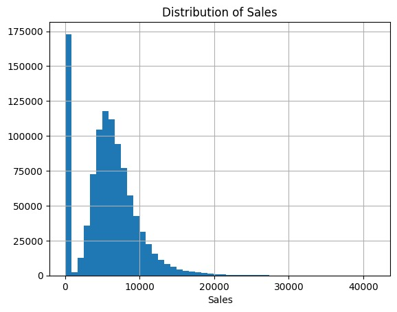
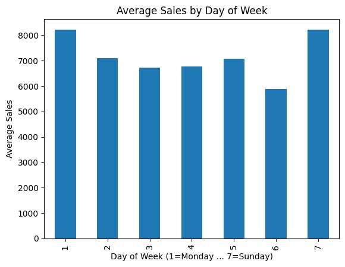
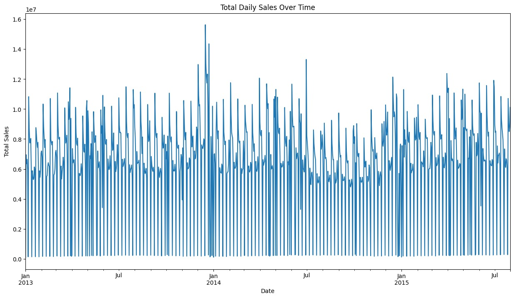
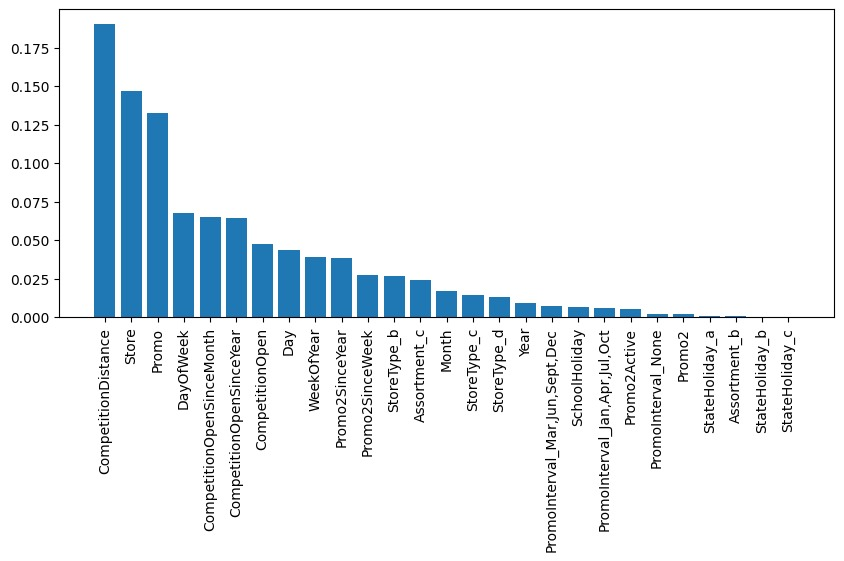

# 🛒 Week 5 – Real-World Machine Learning Project: Retail Sales Forecasting & Demand Prediction

## 📌 Overview
This task is part of the **AI/ML Track Internship at Code Room Hub**.
The objective was to build a complete, real-world machine learning pipeline — from raw data to a trained, evaluated, and compared set of models — to forecast daily retail sales for Rossmann stores using historical sales records and store metadata.

## ✅ Objectives
- [x] Build a complete ML pipeline (load → clean → merge → engineer → encode → split)
- [x] Perform feature engineering on date and competition/promo fields
- [x] Train and compare multiple regression models
- [x] Evaluate models using MAE, RMSE, and R²
- [x] Interpret predictions using feature importance analysis

## 📊 Dataset
- **train.csv** — 1,017,209 rows of daily sales records per store (`Store`, `DayOfWeek`, `Date`, `Sales`, `Customers`, `Open`, `Promo`, `StateHoliday`, `SchoolHoliday`)
- **store.csv** — 1,115 rows of store metadata (`StoreType`, `Assortment`, `CompetitionDistance`, `Promo2`, etc.)

## 🛠️ Tools & Libraries
`Python` `Pandas` `NumPy` `Matplotlib` `Seaborn` `Scikit-learn` `LightGBM`

<strong>🤖 Models Trained (click to expand)</strong>

- Linear Regression
- Random Forest Regressor
- LightGBM Regressor

<strong>📂 Workflow</strong>

1. Loaded `train.csv` and `store.csv`, checked shapes, nulls, and duplicates
2. Cleaned `store.csv` using logic-based fills — `Promo2SinceWeek`/`Promo2SinceYear` → 0, `PromoInterval` → `'None'`, `CompetitionOpenSinceMonth`/`Year` → 0 — and median imputation for `CompetitionDistance`
3. Merged `train` and `store` on `Store` (left join), converted `Date` to datetime
4. Ran EDA: sales distribution, average sales by day of week, promo effect, daily sales trend over time, state holiday effect
5. Engineered features: `Year`, `Month`, `Day`, `WeekOfYear` from `Date`; row-wise `CompetitionOpen` (months since competitor opened, clipped at 0); row-wise `Promo2Active` (whether a store's recurring promo is currently running)
6. One-hot encoded `StoreType`, `Assortment`, `StateHoliday`, `PromoInterval` (`drop_first=True`)
7. Dropped `Customers` (leakage — not known at prediction time) and closed-store rows (`Open == 0`), then dropped the now-constant `Open` column
8. Applied a **time-based split** (train: through May 2015, test: June–July 2015) instead of random shuffling, to respect chronological order
9. Trained and compared three regression models on identical train/test sets
10. Extracted and visualized feature importance from the best-performing model (Random Forest)

## 📊 Exploratory Data Analysis

**Sales Distribution**

**Average Sales by Day of Week**

**Total Daily Sales Over Time**

## 📈 Model Comparison

| Model | MAE | RMSE | R² |
|---|---|---|---|
| Linear Regression | 1977.58 | 2674.01 | 0.261 |
| **Random Forest** | **766.78** | **1107.82** | **0.873** |
| LightGBM | 1328.59 | 1779.38 | 0.673 |

**Random Forest was the best-performing model**, explaining ~87% of the variance in daily sales with the lowest error of the three.

## 📊 Feature Importance (Random Forest)

Top drivers of predicted sales: `CompetitionDistance` (0.190), `Store` (0.147), `Promo` (0.132), `DayOfWeek` (0.068), `CompetitionOpenSinceMonth`/`Year` (0.065 each).

<strong>📁 Files in this folder</strong>

| File | Description |
|---|---|
| `Task_Week_5.ipynb` | Notebook with full pipeline: EDA, feature engineering, model training, and comparison |
| `train.csv` | Daily sales records per store |
| `store.csv` | Store metadata |
| `images/sales_distribution.png` | Histogram of the Sales distribution |
| `images/avg_sales_by_dayofweek.png` | Bar chart of average sales by day of week |
| `images/daily_sales_over_time.png` | Line chart of total daily sales over time |
| `images/feature_importance.png` | Bar chart of feature importance from the Random Forest model |

<strong>💡 Key Takeaways</strong>

- Random Forest (R² = 0.873) substantially outperformed both Linear Regression (R² = 0.261) and LightGBM (R² = 0.673)
- **LightGBM underperforming Random Forest is a notable, honest finding** — despite generally being a stronger algorithm on tabular data, LightGBM was run with default-ish settings (`n_estimators=200`, `learning_rate=0.05`) without further tuning, while Random Forest's defaults happened to fit this dataset's store-level patterns well out of the box. Further hyperparameter tuning on LightGBM would likely close this gap.
- `Store` and `CompetitionDistance` dominate the feature importance ranking — a known limitation, since this suggests the model is partly memorizing per-store sales baselines rather than purely learning generalizable demand patterns
- A **time-based train/test split** (rather than random shuffling) was essential here to simulate realistic forecasting conditions and avoid leaking future information into training
- Dropping `Customers` was a deliberate leakage-prevention step — it's not available at prediction time in a real forecasting scenario

## 🏢 Internship Info
| | |
|---|---|
| **Internship** | AI/ML Track – Code Room Hub |
| **Internship ID** | CRH-2026-ML-014 |
| **Duration** | 1 July 2026 – 30 Aug 2026 |
